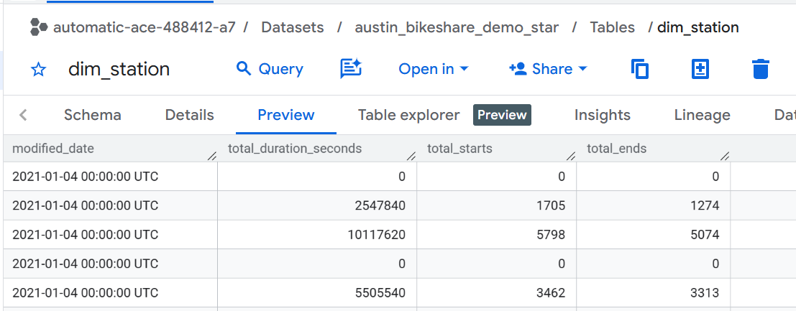
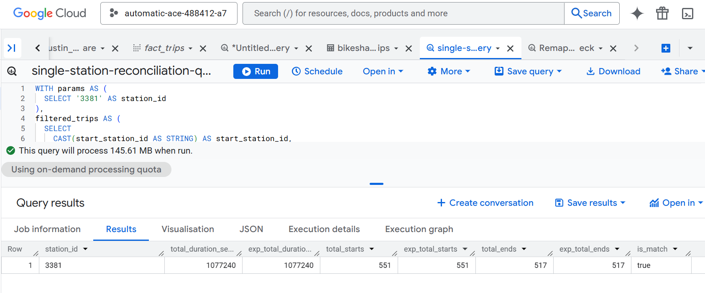
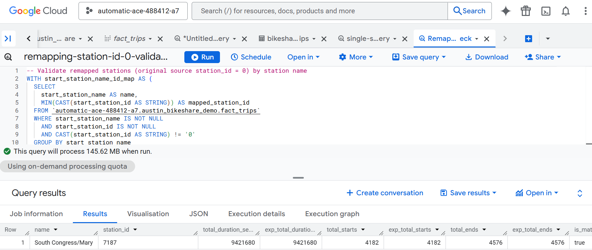

# Assignment

## Brief

Write the SQL statements for the following questions.

## Instructions

Paste the answer as SQL in the answer code section below each question.

### Question 1

Let's revisit our `austin_bikeshare_demo` dbt project. Modify the `dim_station.sql` model to include the following columns:

- `total_duration` (sum of `duration` for each station in seconds)
- `total_starts` (count of `start_station_name` for each station)
- `total_ends` (count of `end_station_name` for each station)

Then, rebuild the models with the following command to see if the changes are correct:

```bash
dbt run
```

Answer:



### Validation query in BigQuery
1) Validate one station_id by comparing expected metrics from raw trips against your dim_station row.
(assignment/remapping-station-id-0-validation.sql)


2) Validate remapped stations (original source station_id = 0) by station name
(assignment/single-station-reconciliation-query.sql)



Paste the `dim_station.sql` model here:

```sql
-- Map start station names to a single reliable station_id from fact_trips.
-- Keep only names that map to exactly one non-zero id.
WITH start_station_name_id_map AS (
    SELECT start_station_name AS name,
        MIN(CAST(start_station_id AS STRING)) AS station_id
    FROM {{ ref('fact_trips') }}
    WHERE start_station_name IS NOT NULL
        AND start_station_id IS NOT NULL
        AND CAST(start_station_id AS STRING) != '0'
    GROUP BY start_station_name
    HAVING COUNT(DISTINCT CAST(start_station_id AS STRING)) = 1
),
-- Map end station names to a single reliable station_id from fact_trips.
-- Used as a fallback if no start-side mapping is available.
end_station_name_id_map AS (
    SELECT end_station_name AS name,
        MIN(CAST(end_station_id AS STRING)) AS station_id
    FROM {{ ref('fact_trips') }}
    WHERE end_station_name IS NOT NULL
        AND end_station_id IS NOT NULL
        AND CAST(end_station_id AS STRING) != '0'
    GROUP BY end_station_name
    HAVING COUNT(DISTINCT CAST(end_station_id AS STRING)) = 1
),
-- Build base station dimension rows from source station data.
-- If source station_id is 0 (bad id), replace with mapped id by station name.
stations AS (
    SELECT DISTINCT CASE
            WHEN CAST(bs.station_id AS STRING) = '0' THEN COALESCE(ssim.station_id, esim.station_id, CAST(bs.station_id AS STRING))
            ELSE CAST(bs.station_id AS STRING)
        END AS station_id,
        bs.name,
        bs.status,
        bs.location,
        bs.address,
        bs.alternate_name,
        bs.city_asset_number,
        bs.property_type,
        bs.number_of_docks,
        bs.power_type,
        bs.footprint_length,
        bs.footprint_width,
        bs.notes,
        bs.council_district,
        bs.image,
        bs.modified_date
    FROM {{ source('austin_bikeshare', 'bikeshare_stations') }} bs
        LEFT JOIN start_station_name_id_map ssim ON bs.name = ssim.name
        LEFT JOIN end_station_name_id_map esim ON bs.name = esim.name
),
-- Aggregate trip metrics for where trips start, grouped by station_id.
start_metrics AS (
    SELECT CAST(start_station_id AS STRING) AS station_id,
        SUM(duration_minutes * 60) AS total_duration_seconds,
        COUNT(start_station_name) AS total_starts
    FROM {{ ref('fact_trips') }}
    GROUP BY start_station_id
),
-- Aggregate trip metrics for where trips end, grouped by station_id.
end_metrics AS (
    SELECT CAST(end_station_id AS STRING) AS station_id,
        COUNT(end_station_name) AS total_ends
    FROM {{ ref('fact_trips') }}
    GROUP BY end_station_id
)
-- Final station dimension output: station attributes + start/end usage metrics.
SELECT s.station_id,
    s.name,
    s.status,
    s.location,
    s.address,
    s.alternate_name,
    s.city_asset_number,
    s.property_type,
    s.number_of_docks,
    s.power_type,
    s.footprint_length,
    s.footprint_width,
    s.notes,
    s.council_district,
    s.image,
    s.modified_date,
    -- Use COALESCE to handle cases where there are no trips starting or ending at a station
    COALESCE(sm.total_duration_seconds, 0) AS total_duration_seconds,
    COALESCE(sm.total_starts, 0) AS total_starts,
    COALESCE(em.total_ends, 0) AS total_ends
FROM stations s
    LEFT JOIN start_metrics sm ON s.station_id = sm.station_id
    LEFT JOIN end_metrics em ON s.station_id = em.station_id
```

## Submission

- Submit the URL of the GitHub Repository that contains your work to NTU black board.
- Should you reference the work of your classmate(s) or online resources, give them credit by adding either the name of your classmate or URL.
